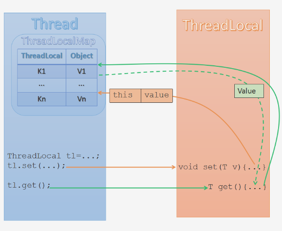

# ThreadLocal

[stack-overflow-ThreadLocal Resource Leak and WeakReference](https://stackoverflow.com/questions/940506/threadlocal-resource-leak-and-weakreference)
## 一 TreadLocal 概念引入

### 1.1 线程安全

- 悲观锁 synchronized lock
- CAS
- 无同步，没有涉及到共享数据，所以不需要采取措施保证同步。

### 1.2 示例用法

```java
public class ThreadLocalDemo {
    public static void main(String[] args) {

      	// 声明 ThreadLocal对象
        ThreadLocal<Boolean> mThreadLocal = new ThreadLocal<Boolean>();

        // 在主线程、子线程1、子线程2中去设置访问它的值
        mThreadLocal.set(true);

        System.out.println("Main " + mThreadLocal.get());

        new Thread("Thread#1"){
            @Override
            public void run() {
                mThreadLocal.set(false);
                System.out.println("Thread#1 " + mThreadLocal.get());
            }
        }.start();

        new Thread("Thread#2"){
            @Override
            public void run() {
                System.out.println("Thread#2 " + mThreadLocal.get());
            }
        }.start();
    }
}

// 打印结果
MainThread true
Thread#1 false
Thread#2 null
```

通过以上示例可以看出，在不同的线程对同一个 ThreadLocal 对象 设置数值，在不同的线程中 取出来的值不一样，接下来就分析一下源码，看看起内部结构。

### 1.3 结构概览



清晰的看到一个线程 Thread 中存在一个ThreadLocalMap ,ThreadLocalMap 中的Key 对应 ThreadLocal ,在次数可见 Map 可以存储多个 Key即(ThreadLocal)，另外 Value就对应着在 ThreadLocal中存储的Value.因此总结出:每个Thread中都具备一个 ThreadLocalMap ,而ThreadLocalMap可以存储 以ThreadLocal 为key的键值对。这就解释了 为什么每个线程访问同一个 ThreadLocal ，得到的确不同的数值。

### 1.4 源码

ThreadLocal#set

```java
 public void set(T value) {
        // 获取当前线程对象
        Thread t = Thread.currentThread();
        // 根据当前线程的对象获取其内部Map
        ThreadLocalMap map = getMap(t);
        // 注释1
        if (map != null)
            map.set(this, value);
        else
            createMap(t, value);
    }
```

如上所示，在注释1 处，得到map对象之后，用的this 作为key，this在这里代表的是当前线程的ThreadLocal对象。另外就是第二句根据 getMap获取一个 ThreadLocalMap,其中 getMap 中传入的参数 t(当前线程对象),这样就能够获取每个线程的ThreadLocal了，继续跟进 ThreadLocalMap中的查看set方法:

ThreadLocalMap

ThreadLocalMap 是 ThreadLocal的一个内部类，在分析起set方法之前，查看一下其类结构和成员变量.
```java
static class ThreadLocalMap {
        // Entry类继承了WeakReference<ThreadLocal<?>>，即每个Entry对象都有一个ThreadLocal的弱引用
   //（作为key），这是为了防止内存泄露。一旦线程结束，key变为一个不可达的对象，这个Entry就可以被GC了。
        static class Entry extends WeakReference<ThreadLocal<?>> {
            /** The value associated with this ThreadLocal. */
            Object value;
            Entry(ThreadLocal<?> k, Object v) {
                super(k);
                value = v;
            }
        }
        // ThreadLocalMap 的初始容量，必须为2的倍数
        private static final int INITIAL_CAPACITY = 16;

        // resized时候需要的table
        private Entry[] table;

        // table中的entry个数
        private int size = 0;

        // 扩容数值
        private int threshold; // Default to 0

```

### 1.5 ThreadLocal 内存泄露问题

`ThreadLocalMap` 中使用的 key 为 `ThreadLocal` 的弱引用,而 value 是强引用。所以，如果 `ThreadLocal` 没有被外部强引用的情况下，在垃圾回收的时候会 key 会被清理掉，而 value 不会被清理掉。这样一来，`ThreadLocalMap` 中就会出现key为null的Entry。假如我们不做任何措施的话，value 永远无法被GC 回收，这个时候就可能会产生内存泄露。ThreadLocalMap实现中已经考虑了这种情况，在调用 `set()`、`get()`、`remove()` 方法的时候，会清理掉 key 为 null 的记录。使用完 `ThreadLocal`方法后 最好手动调用`remove()`方法 .同时线程 dead的时候，线程所有的数据都会被回收。

有一种危险是，如果线程是线程池的， 在线程执行完代码的时候并没有结束，只是归还给线程池，这个时候ThreadLocalMap 和里面的元素是不会回收掉的


```java
      static class Entry extends WeakReference<ThreadLocal<?>> {
            /** The value associated with this ThreadLocal. */
            Object value;

            Entry(ThreadLocal<?> k, Object v) {
                super(k);
                value = v;
            }
        }
```


## 源码部分讲解

```java
    public void set(T value) {
        Thread t = Thread .currentThread();
        // 获取线程绑定的ThreadLocalMap
        ThreadLocalMap map = getMap(t);
        if (map != null)
            map.set(this, value);
        else
           //第一次设置值的时候进来是这里
            createMap(t, value);
    }
    void createMap(Thread t, T firstValue) {
        t.threadLocals = new ThreadLocalMap(this, firstValue);
    }

```

createMap 方法只是在第一次设置值的时候创建一个ThreadLocalMap 赋值给Thread 对象的threadLocals 属性进行绑定，以后就可以直接通过这个属性获取到值了。从这里可以看出，为什么说ThreadLocal 是线程本地变量来的了

- HashMap 是通过链地址法解决hash 冲突的问题
- ThreadLocalMap 是通过开放地址法来解决hash 冲突的问题

### 开放地址法

这种方法的基本思想是`一旦发生了冲突，就去寻找下一个空的散列地址(这非常重要，源码都是根据这个特性，必须理解这里才能往下走)，只要散列表足够大，空的散列地址总能找到，并将记录存入`。[参考链接](https://juejin.im/post/5d8b2bde51882509372faa7c)

