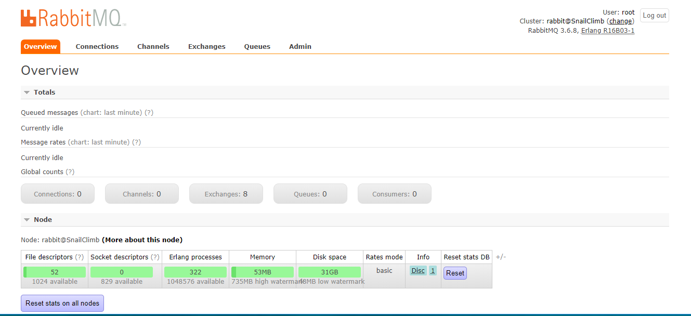

## 二 安装 RabbitMq

通过 Docker 安装非常方便，只需要几条命令就好了，我这里是只说一下常规安装方法。

前面提到了 RabbitMQ 是由 Erlang语言编写的，也正因如此，在安装RabbitMQ 之前需要安装 Erlang。

注意：在安装 RabbitMQ 的时候需要注意 RabbitMQ 和 Erlang 的版本关系，如果不注意的话会导致出错，两者对应关系如下:


### 2.1 安装 erlang

**1 下载 erlang 安装包**

在官网下载然后上传到 Linux 上或者直接使用下面的命令下载对应的版本。

```shell
[root@SnailClimb local]#wget http://erlang.org/download/otp_src_19.3.tar.gz
```

erlang 官网下载：[http://www.erlang.org/downloads](http://www.erlang.org/downloads)  

 **2 解压 erlang 安装包**

```shell
[root@SnailClimb local]#tar -xvzf otp_src_19.3.tar.gz
```

**3 删除 erlang 安装包**

```shell
[root@SnailClimb local]#rm -rf otp_src_19.3.tar.gz
```

**4 安装 erlang 的依赖工具**

```shell
[root@SnailClimb local]#yum -y install make gcc gcc-c++ kernel-devel m4 ncurses-devel openssl-devel unixODBC-devel
```

**5 进入erlang 安装包解压文件对 erlang 进行安装环境的配置**

新建一个文件夹

```shell
[root@SnailClimb local]# mkdir erlang
```

对 erlang 进行安装环境的配置

```shell
[root@SnailClimb otp_src_19.3]# 
./configure --prefix=/usr/local/erlang --without-javac
```

**6 编译安装**

```shell
[root@SnailClimb otp_src_19.3]# 
make && make install
```

**7 验证一下 erlang 是否安装成功了**

```shell
[root@SnailClimb otp_src_19.3]# ./bin/erl
```
运行下面的语句输出“hello world”

```erlang
 io:format("hello world~n", []).
```


大功告成，我们的 erlang 已经安装完成。

**8 配置  erlang 环境变量**

```shell
[root@SnailClimb etc]# vim profile
```

追加下列环境变量到文件末尾

```shell
#erlang
ERL_HOME=/usr/local/erlang
PATH=$ERL_HOME/bin:$PATH
export ERL_HOME PATH
```

运行下列命令使配置文件`profile`生效

```shell
[root@SnailClimb etc]# source /etc/profile
```

输入 erl 查看 erlang 环境变量是否配置正确

```shell
[root@SnailClimb etc]# erl
```


### 2.2 安装 RabbitMQ

**1. 下载rpm** 

```shell
wget https://www.rabbitmq.com/releases/rabbitmq-server/v3.6.8/rabbitmq-server-3.6.8-1.el7.noarch.rpm
```
或者直接在官网下载

https://www.rabbitmq.com/install-rpm.html[enter link description here](https://www.rabbitmq.com/install-rpm.html)

**2. 安装rpm**

```shell
rpm --import https://www.rabbitmq.com/rabbitmq-release-signing-key.asc
```
紧接着执行：

```shell
yum install rabbitmq-server-3.6.8-1.el7.noarch.rpm
```
中途需要你输入"y"才能继续安装。

**3 开启 web 管理插件**

```shell
rabbitmq-plugins enable rabbitmq_management
```

**4 设置开机启动**

```shell
chkconfig rabbitmq-server on
```

**4. 启动服务**

```shell
service rabbitmq-server start
```

**5. 查看服务状态**

```shell
service rabbitmq-server status
```

**6. 访问 RabbitMQ 控制台**

浏览器访问：http://你的ip地址:15672/

默认用户名和密码： guest/guest;但是需要注意的是：guestuest用户只是被容许从localhost访问。官网文档描述如下：

```shell
“guest” user can only connect via localhost
```

**解决远程访问 RabbitMQ 远程访问密码错误**

新建用户并授权 

```shell
[root@SnailClimb rabbitmq]# rabbitmqctl add_user root root
Creating user "root" ...
[root@SnailClimb rabbitmq]# rabbitmqctl set_user_tags root administrator

Setting tags for user "root" to [administrator] ...
[root@SnailClimb rabbitmq]# 
[root@SnailClimb rabbitmq]# rabbitmqctl set_permissions -p / root ".*" ".*" ".*"
Setting permissions for user "root" in vhost "/" ...

```

再次访问:http://你的ip地址:15672/ ,输入用户名和密码：root root

