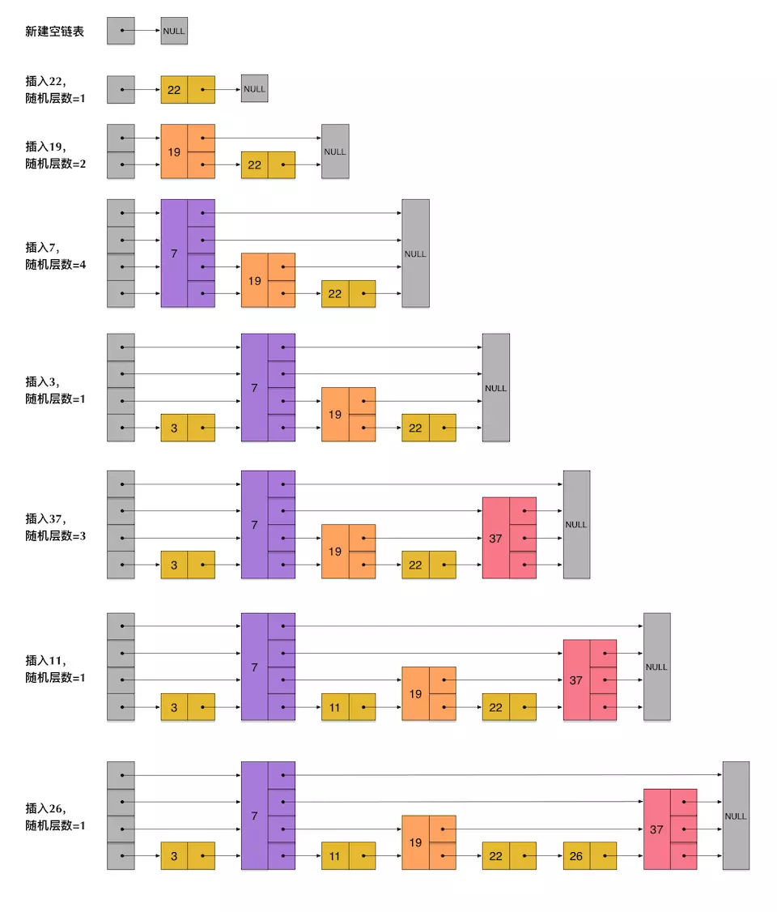

## Redis 为什么用跳表而不用平衡树？

[原文链接](https://juejin.im/post/57fa935b0e3dd90057c50fbc)

Redis里面使用skiplist是为了实现sorted set这种对外的数据结构。sorted set提供的操作非常丰富，可以满足非常多的应用场景。这也意味着，sorted set相对来说实现比较复杂。同时，skiplist这种数据结构对于很多人来说都比较陌生，因为大部分学校里的算法课都没有对这种数据结构进行过详细的介绍。因此，为了介绍得足够清楚，本文会比这个系列的其它几篇花费更多的篇幅。
我们将大体分成三个部分进行介绍：

1. 介绍经典的skiplist数据结构，并进行简单的算法分析。这一部分的介绍，与Redis没有直接关系。我会尝试尽量使用通俗易懂的语言进行描述。
2. 讨论Redis里的skiplist的具体实现。为了支持sorted set本身的一些要求，在经典的skiplist基础上，Redis里的相应实现做了若干改动。
3. 讨论sorted set是如何在skiplist, dict和ziplist基础上构建起来的。


我们在讨论中还会涉及到两个Redis配置（在redis.conf中的ADVANCED CONFIG部分）：

```
zset-max-ziplist-entries 128
zset-max-ziplist-value 64
```
我们在讨论中会详细解释这两个配置的含义。

注：本文讨论的代码实现基于Redis源码的3.2分支。

## skiplist数据结构简介

skiplist本质上也是一种查找结构，用于解决算法中的查找问题（Searching），即根据给定的key，快速查到它所在的位置（或者对应的value）。
我们在《Redis内部数据结构详解》系列的第一篇中介绍dict的时候，曾经讨论过：一般查找问题的解法分为两个大类：一个是基于各种平衡树，一个是基于哈希表。但skiplist却比较特殊，它没法归属到这两大类里面。
这种数据结构是由William Pugh发明的，最早出现于他在1990年发表的论文《Skip Lists: A Probabilistic Alternative to Balanced Trees》。对细节感兴趣的同学可以下载论文原文来阅读。


skiplist，顾名思义，首先它是一个list。实际上，它是在有序链表的基础上发展起来的。

我们先来看一个有序链表，如下图（最左侧的灰色节点表示一个空的头结点）：


在这样一个链表中，如果我们要查找某个数据，那么需要从头开始逐个进行比较，直到找到包含数据的那个节点，或者找到第一个比给定数据大的节点为止（没找到）。也就是说，时间复杂度为O(n)。同样，当我们要插入新数据的时候，也要经历同样的查找过程，从而确定插入位置。
假如我们每相邻两个节点增加一个指针，让指针指向下下个节点，如下图：


这样所有新增加的指针连成了一个新的链表，但它包含的节点个数只有原来的一半（上图中是7, 19, 26）。现在当我们想查找数据的时候，可以先沿着这个新链表进行查找。当碰到比待查数据大的节点时，再回到原来的链表中进行查找。比如，我们想查找23，查找的路径是沿着下图中标红的指针所指向的方向进行的：


- 23首先和7比较，再和19比较，比它们都大，继续向后比较。
- 但23和26比较的时候，比26要小，因此回到下面的链表（原链表），与22比较。
- 23比22要大，沿下面的指针继续向后和26比较。23比26小，说明待查数据23在原链表中不存在，而且它的插入位置应该在22和26之间。

在这个查找过程中，由于新增加的指针，我们不再需要与链表中每个节点逐个进行比较了。需要比较的节点数大概只有原来的一半。

利用同样的方式，我们可以在上层新产生的链表上，继续为每相邻的两个节点增加一个指针，从而产生第三层链表。如下图：


在这个新的三层链表结构上，如果我们还是查找23，那么沿着最上层链表首先要比较的是19，发现23比19大，接下来我们就知道只需要到19的后面去继续查找，从而一下子跳过了19前面的所有节点。可以想象，当链表足够长的时候，这种多层链表的查找方式能让我们跳过很多下层节点，大大加快查找的速度。

skiplist正是受这种多层链表的想法的启发而设计出来的。实际上，按照上面生成链表的方式，上面每一层链表的节点个数，是下面一层的节点个数的一半，这样查找过程就非常类似于一个二分查找，使得查找的时间复杂度可以降低到O(log n)。但是，这种方法在插入数据的时候有很大的问题。新插入一个节点之后，就会打乱上下相邻两层链表上节点个数严格的2:1的对应关系。如果要维持这种对应关系，就必须把新插入的节点后面的所有节点（也包括新插入的节点）重新进行调整，这会让时间复杂度重新蜕化成O(n)。删除数据也有同样的问题。


skiplist为了避免这一问题，它不要求上下相邻两层链表之间的节点个数有严格的对应关系，而是为每个节点随机出一个层数(level)。比如，一个节点随机出的层数是3，那么就把它链入到第1层到第3层这三层链表中。为了表达清楚，下图展示了如何通过一步步的插入操作从而形成一个skiplist的过程（点击看大图）：




从上面skiplist的创建和插入过程可以看出，每一个节点的层数（level）是随机出来的，而且新插入一个节点不会影响其它节点的层数。因此，插入操作只需要修改插入节点前后的指针，而不需要对很多节点都进行调整。这就降低了插入操作的复杂度。实际上，这是skiplist的一个很重要的特性，这让它在插入性能上明显优于平衡树的方案。这在后面我们还会提到。

根据上图中的skiplist结构，我们很容易理解这种数据结构的名字的由来。skiplist，翻译成中文，可以翻译成“跳表”或“跳跃表”，指的就是除了最下面第1层链表之外，它会产生若干层稀疏的链表，这些链表里面的指针故意跳过了一些节点（而且越高层的链表跳过的节点越多）。这就使得我们在查找数据的时候能够先在高层的链表中进行查找，然后逐层降低，最终降到第1层链表来精确地确定数据位置。在这个过程中，我们跳过了一些节点，从而也就加快了查找速度。


刚刚创建的这个skiplist总共包含4层链表，现在假设我们在它里面依然查找23，下图给出了查找路径：


需要注意的是，前面演示的各个节点的插入过程，实际上在插入之前也要先经历一个类似的查找过程，在确定插入位置后，再完成插入操作。

至此，skiplist的查找和插入操作，我们已经很清楚了。而删除操作与插入操作类似，我们也很容易想象出来。这些操作我们也应该能很容易地用代码实现出来。

当然，实际应用中的skiplist每个节点应该包含key和value两部分。前面的描述中我们没有具体区分key和value，但实际上列表中是按照key进行排序的，查找过程也是根据key在比较。

但是，如果你是第一次接触skiplist，那么一定会产生一个疑问：节点插入时随机出一个层数，仅仅依靠这样一个简单的随机数操作而构建出来的多层链表结构，能保证它有一个良好的查找性能吗？为了回答这个疑问，我们需要分析skiplist的统计性能。

在分析之前，我们还需要着重指出的是，执行插入操作时计算随机数的过程，是一个很关键的过程，它对skiplist的统计特性有着很重要的影响。这并不是一个普通的服从均匀分布的随机数，它的计算过程如下：

- 首先，每个节点肯定都有第1层指针（每个节点都在第1层链表里）。

如果一个节点有第i层(i>=1)指针（即节点已经在第1层到第i层链表中），那么它有第(i+1)层指针的概率为p。

接下来的没有整理 ：

https://juejin.im/post/57fa935b0e3dd90057c50fbc


## skiplist与平衡树、哈希表的比较

- skiplist和各种平衡树（如AVL、红黑树等）的元素是有序排列的，而哈希表不是有序的。因此，在哈希表上只能做单个key的查找，不适宜做范围查找。所谓范围查找，指的是查找那些大小在指定的两个值之间的所有节点。

- 在做范围查找的时候，平衡树比skiplist操作要复杂。在平衡树上，我们找到指定范围的小值之后，还需要以中序遍历的顺序继续寻找其它不超过大值的节点。如果不对平衡树进行一定的改造，这里的中序遍历并不容易实现。而在skiplist上进行范围查找就非常简单，只需要在找到小值之后，对第1层链表进行若干步的遍历就可以实现。

- 平衡树的插入和删除操作可能引发子树的调整，逻辑复杂，而skiplist的插入和删除只需要修改相邻节点的指针，操作简单又快速。

- 从内存占用上来说，skiplist比平衡树更灵活一些。一般来说，平衡树每个节点包含2个指针（分别指向左右子树），而skiplist每个节点包含的指针数目平均为1/(1-p)，具体取决于参数p的大小。如果像Redis里的实现一样，取p=1/4，那么平均每个节点包含1.33个指针，比平衡树更有优势。

- 查找单个key，skiplist和平衡树的时间复杂度都为O(log n)，大体相当；而哈希表在保持较低的哈希值冲突概率的前提下，查找时间复杂度接近O(1)，性能更高一些。所以我们平常使用的各种Map或dictionary结构，大都是基于哈希表实现的。

- 从算法实现难度上来比较，skiplist比平衡树要简单得多。

