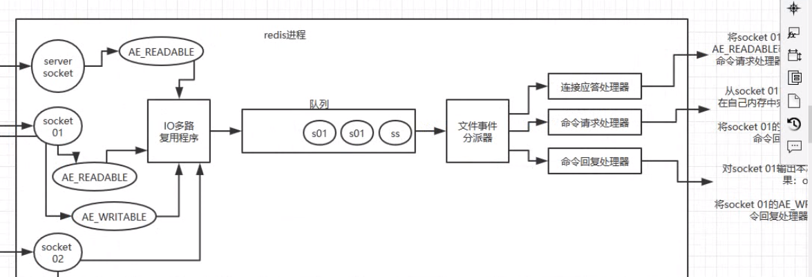

# 缓存 Redis

[Redis](https://www.bilibili.com/video/av49561181/?p=31)
## 为什么使用缓存
1. 高性能

 10分钟之内查询同一个数据，DB每个人耗时 800ms,使用缓存。从缓存中获取数据 消耗 10ms
2. 高并发

高峰期每秒4000个请求，3000个走缓存，1000个走数据库，缓存走内存，数据库
并发请求不要超过 2000/s

## Redis 单线程模型
1. 为什么单线程还支持高并发

    - IO多路复用
    - 纯内存的操作
    - 避免了上下文切换

File Event Handler, 采用 IO多路复用机制同时监听多个 socket， 根据 socket 上的事件来选择对应的事件处理器来处理这个事件。 如果监听到 accept,read,write,close等操作，就会产生相应的文件事件，就会调用之前关联好的事件处理器来处理这个事件。



## Redis与Memeched区别
1. 丰富数据类型  --- string
2. 集群模式 ---- 不支持集群

## Redis 数据类型

比较基础的问题。

- string
- hash 缓存简单的对象
- list 好友列表，lrange 分页查询
- set 去重数据 交并差集
- zset 排行榜 zadd borad 85 zhangsan

## Redis 过期策略

缓存是基于内存的，内存是有限制的。

定期删除，惰性删除

过期时间 1小时

随机抽取key检查删除，后面在获取key的时候，检查一下过期，惰性删除。

内存淘汰机制： 内存满了，移除最近最少使用的

定期删除 -> 惰性删除 -> 内存淘汰机制 最近很少使用的

LRU 代码实现

## Redis 高并发 高可用 哨兵原理

如果 Redis支撑 10万+ 的QPS, 读写分离
单机 redis 能够承载 QPS 是上万。缓存一般 用来处理读并发。

一主多从，主 负责写，并将数据同步复制到其他 slave节点，从节点复杂读。

可以水平扩容。
5000QPS 高峰期
主从架构 -> 读写分离 -> 支撑 10万+ QPS的架构

master 节点必须使用持久化机制。

高可用： 哨兵机制。（待完善）

## 持久化

持久化 + 定期备份云存储 

AOF + RDB 优缺点

## Redis 集群模式原理

redis cluster 集群模式

## 缓存雪崩 缓存穿透

缓存宕机 -> 全部请求落在数据库 -> 数据库奔溃

key 大部分失效 -> 双重过期时间 -> 预加载

首先 保证 Redis集群的高可用性。

限流 : 每秒 限制 2000个请求,这样数据库不会死。

降级: 
hystrix

缓存穿透 -> 缓存与数据都没有数据 -> 默认值

## 数据一致性问题

不要求 强一致性，最好不要做这个方案。

如果要求，则需要串行化，会导致吞吐量降低。

## Redis 并发竞争问题 以及 解决方案

分布式锁：

zookeeper 与 redis

[address](https://www.bilibili.com/video/av49561181?t=415&p=62)


# 底层数据结构

## String

SDS: `simple dynamic string`
```c
struct sds
{
    int free; // 用来保存剩余的长度
    int len; // 用来保存已经使用的长度
    char[];
}
```

相比 C 语言原生的优点：


1. 保留了 length 不用遍历 
2. 避免了 缓存溢出，自动扩容
3. 空间预分配，惰性释放
4. 二进制一些特殊编码的问题

### 字符串对象

set 222;

encoding 格式 以及 ptr 属性值。

str -> encoding : raw . -> sds

long double 也是作为 字符串保存的。


## 链表

c语言中没有链表。

```c
typedef struct listNode 
{
    struct listNode *pre;
    struct listNode *next;
    void   * value;
}listNode
```
双向链表，带 length,与其他语言中的链表并无区别。

tail ,head. 

列表，订阅查询，客户端信息都是使用这个数据结构。

## 字典

hash的底层实现。

```c
typedef struct dictht {
    // 哈希表数组
    dictEntry **table;
    // 哈希表大小
    unsigned long size;
    // 哈希表大小掩码，用于计算索引值，= size -1
    unsigned long sizemask;
    // 该哈希表已经有节点的数量
    unsigned long used;
}dictht;
```

index = hash & (length -1)

字典的扩容，加载因子，寻址，冲突解决办法与 hashmap 类似

## 跳跃表

zset,集群节点。

平均 O(logN) 时间复杂度可以与 平衡树 媲美。牺牲空间换时间。

具体可以参考 跳跃表的文章。

跳跃表是分层的，随机分层。所谓的层，其实就是维护了一个数组。

### skiplist and avl

1. skiplist 简单
2. 不涉及树的变动
3. 查找起来简单，范围查找。next节点不是太死板固定。


## 集合

set 底层使用的是数组，这一块还挺麻烦的，没有仔细看。具体的可以参考 Redis设计与实现这本书。


# Redis 对象问题

redis 采用 引用计数的GC方式。

## 字符串对象

redis 中每一个对象都是由一个 redisObject 结构表示。该结构保存了 三个 属性： type属性， encoding 属性，ptr属性。

type:是以下枚举中的几个：

    REDIS_STRING, REDIS_LIST,REDIS_HASH,REDIS_SET,REDIS_ZSET

列表对象底层并不一定使用 双端列表，在元素数量比较少的时候，使用压缩列表。

## ZSet对象

zset底层使用`skiplist`和`dict` 前者可以保留 范围快速查找的特性，后者 可以保留 单个元素快速查找的特性，ZScore.

## 读取键时候的操作

1. 读取键的时候，更新 hit,miss,以及最后访问时间，计算出空闲时间
2. 读取键的时候，发现过期，会线删除这个键
3. 服务器每修改一个键之后，都会对 dirty键计数器 增1，这个计数器会触发服务器持久化以及复制操作。

## expire

设置过期时间。

expire key 5 -> 设置 key 5秒后过期 

所有过期相关的命令底层都是这个实现的 expireat + 时间戳

redis 数据库中 使用 expires 字典保存数据库中所有key的过期时间，key 指向 键空间中的某个对象。

## 删除策略

定时删除 -> 浪费 CPU

惰性删除 -> 用到检查 浪费内存

定期删除 ->

服务器实际采用的是 惰性删除 和 定时删除两种策略。合理的使用了 CPU 和避免 内存浪费的权衡。

定期删除： 在 expire 字典中随机选择进行删除。

过期的 键 在save RDB中会删除, 主服务器在 RDB 加载的时候，不会加载过期的。从服务器会加载。

AOF 在删除的时候，如果键被定期或者惰性删除，会在文件中追加`DEL`命令.AOF 重写的时候不会写到 AOF 文件中。

`重点`：Redis 的过期删除操作都是 主服务器完成的，删除之后 发送 DEL 命令。从 服务器即使发现 键过期，也是继续返回，并不会删除，这是为了维护 数据的一致性。

# RDB

RDB 持久化功能所生成的RDB文件是一个经过压缩的二进制文件，通过该文件可以还原生成 RDB文件时候的数据库状态。

## 命令 

生成 RDB的零个命令： SAVE, BGSAVE. 前者 `SAVE`阻塞 Redis 服务器进程，知道 RDB文件创建完毕为止，在服务器阻塞期间，服务器不能处理任何命令请求。后者`BGSAVE` 命令 会派生出一个紫禁城，然后由子进程创建 RDB文件。服务器的父进程 继续处理命令请求。

因为 `AOF` 文件的更新频率通常 比 `RDB` 文件的更新频率高，所以 
- 如果开启了 AOF 持久化功能，服务器优先使用 AOF 文件来还原数据库状态。
- 没有 开启 AOF,才会使用 RDB 

## dirty 计数器 以及 lastsave 属性

- dirty 计数器 记录 距离上一次成功执行save 或者 bgsave 之后，服务器对数据库状态进行了多少次修改（写入，删除，更新操作）
- lastsave是记录服务器上次成功执行 save bgsave的时间戳

redis 会周期性的检查（100ms）是否满足所设置的保存条件，如果满足执行 bgsave。

## RDB 文件结构 略过

# AOF

AOF 持久化 保存数据库状态的方法 是将 服务器执行的 SET ,SADD,SPUSH三个命令 保存到 AOF文件中。

AOF 持久化功能的实现 可以分为 命令追加（append），文件写入，文件同步（sync）三个步骤。

- 命令追加 服务器执行完成一个 写 命令之后，会以协议格式将执行的写命令 追加到服务器 状态 aof_buf缓冲区的末尾。

- AOF 写入与同步

    默认的是 每秒写入 everysec ,这种方式也是一种 平衡型的，因为 如果宕机丢失的是一秒种的数据。

## AOF 数据载入

使用 伪客户端，从AOF 文件中读取一条写命令 -> 执行 -> 直到全部执行完成

## AOF 重写

AOF 的重写并不是操作 原来的 AOF 文件，二十 直接从数据库读取 值，重新换一条高效的命令之前保存的复杂 冗余的命令。

AOF 的重写过程也是 扔到 子进程进行处理的。但是在 AOF 重写期间，服务器还需要继续处理命令请求，新的命令可能会对现有的数据库状态进行修改，从而使得当前数据库的状态与 重写后 的AOF文件所保存的数据库状态不一致。解决方案 `AOF 重写缓冲区` ,AOF 重写完成之后，调用 父进程 阻塞的进行 AOF重写缓冲区 进行追加。然后原子性的替换旧的文件。

# 事件

Redis 基于 Reactor 模式 开发自己的网络事件处理器：这个处理器 被称为 文件事件处理器 （file event handler）：

- 文件事件处理器使用的是 IO多路复用程序来监听多个套接字，并且根据 套接字目前执行的任务来为 套接字关联不同的事件处理器。
- 当被监听的套接字准备好执行 连接应答（accept），读取（read）,写入（write）关闭（close）等操作时候，与操作相对应的文件事件就会产生。这时候文件事件处理器就会调用套接字之前关联好的事件处理器来处理这些事件。

## 文件事件处理器的构成

1. 套接字
2. IO多路复用程序 -> 队列
3. IO事件分派器
4. 事件处理器

## 事件的类型

- AE_READABLE 当 socket 变得`可读`时，或者 有新的 可应答 `acceptable` 套接字出现时候（客户端按对服务器的监听套接字执行 connect操作）
- AE_READABLE 当套接字变得可写时，套接字产生 此事件

## 事件处理器

<!-- 当 Redis 服务器初始化的时候，程序会将这个连接应答处理器 和 服务器监听套接字 AE_READABLE 事件关联起来， -->

## 完整流程

参考 redis设计与事件 事件部分

假设一个 Redis 服务器正在运作，那么这个服务器的监听套接字 的 AE_READABLE 事件，该事件对应的处理器为 `连接应答处理器` 。
如果这时候有一个 Redis 客户端向 服务器 发起连接，那么监听套接字将产生 AE_READABLE 事件，触发连接应答处理器的执行。处理器对客户端的连接请求进行应答，然后`创建客户端套接字`,以及客户端的状态，并且将客户端套接字的 `AE_READABLE` 事件与命令请求处理器进行关联，使得客户端可以下向主服务器发送命令请求
。

之后，假设客户端 向 主服务器发送了一个命令请求，那么客户端的套接字将产生 AE_READABLE 事件，引发命令请求处理器执行，处理器读取客户端的命令内容，然后传递给相关程序去执行。

执行命令将产生相应的命令回复，服务器将客户端套接字 的 AE_WRITEABLE 事件与命令回复处理器进行关联。当客户端进行超时读取命令回复的时候，客户端套接字 将产生 AE_WRITEABLE 事件，触发命令回复处理器执行，当全部写入的时候，解除相关关联。


