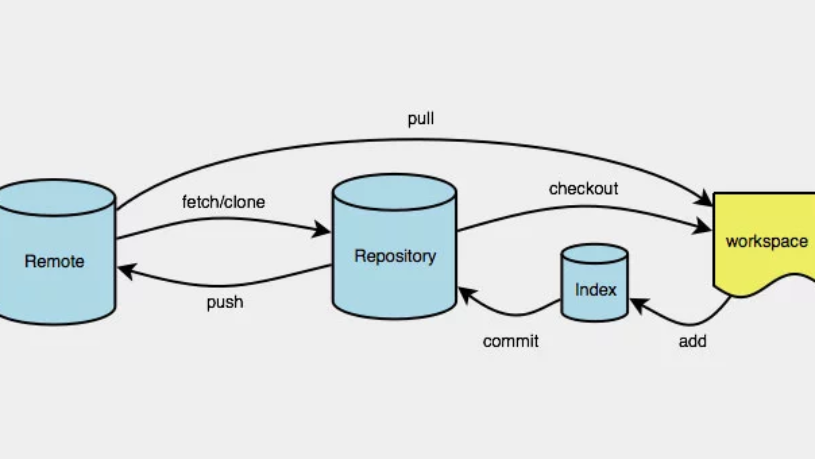
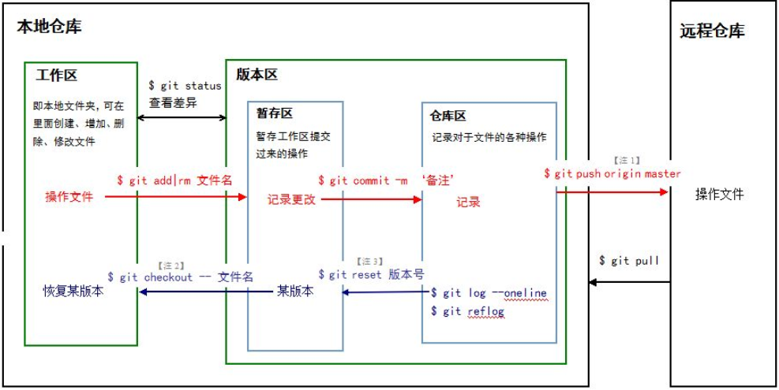

# Git

> 本文为对Git 命令的一次总结实战。[文章来源](https://juejin.im/post/5a2cdfe26fb9a0452936b07f) 掌握常用的命令，而不是使用图形化的工具，对于Linux下处理各种git问题非常有必要。






```bash
git checkout branch01 # → （创建）本地 分支 branch01

git push # → 推送当前分支到远端仓库

```

------------遵循小批量提交原则------------
```bash
git status   # → 查看当前分支工作区、暂存区的工作状态

git diff   # → diff文件的修改（⚠️很重要很重要很重要） 比较工作区与 Stage区的差异

git commit .   # → 提交本次修改

```
------------以上三步使用最频繁-----------

```bash
git fetch --all   # → 拉取所有远端的最新代码 (用不到.git下)
git fetch --p # → 更新分支
git merge origin/develop   # → 如果是多人协作，merge同事的修改到当前分支（先人后己原则）=====>
```
---

👉 HEAD：当前commit引用

```bash
git version   # → git版本
git branch   # → 查看本地所有的分支
git branch -r # → 查看所有远程的分支
git branch -a # → 查看所有远程分支和本地分支
git branch -d <branchname> # → 删除本地branchname分
git checkout branch01 # 切换分支(假如本地有这个分支) 没有分支 需要加 -b 。创建分支+ 切换

git checkout -b <branchname> # → 等同于执行上两步，即创建新的分支并切换到该分支

git checkout -- xx/xx # → 回滚单个文件 相当于 revert

git pull origin master:master # → 将远程origin主机的master分支合并到当前master分支,冒号后面的部分表示当前本地所在的分支

git push origin -d <branchname>   # → 删除远程branchname分支

git commit ./xx   # → 等同于git add ./xx + git commit（建议使用👍）（走add + commit就行）

git stash # → 把当前的工作隐藏起来 等以后恢复现场后继续工作（有应急任务的时候处理）

git stash pop # → 恢复工作现场（恢复隐藏的文件，同时删除stash列表中对应的内容）

git merge --abort  # → 终止本次merge，并回到merge前的状态（👍）

git pull origin master  # → 从远程获取最新版本并merge到本地等同于

git log xx  # → 查看xx文件的commit记录

git pull --rebase #=======================================>

```

## 版本的回溯与前进

提交一个文件，有时候我们会提交很多次，在提交历史中，这样就产生了不同的版本。每次提交，Git会把他们串成一条时间线。如何回溯到我们提交的上一个版本，用`git reset --hard + 版本号`即可。 版本号可以用`git log`来查看，每一次的版本都会产生不一样的版本号。回溯之后，git log查看一下发现离我们最近的那个版本已经不见了。但是我还想要前进到最近的版本应该如何？只要`git reset --hard + 版本号`就行。退一步来讲，虽然我们可以通过git reset --hard + 版本号,靠记住版本号来可以在不同的版本之间来回穿梭。但是,有时候把版本号弄丢了怎么办？`git reflog`帮你记录了每一次的命令，这样就可以找到版本号了，这样你又可以通过`git reset`来版本穿梭了。
。

通过 git pull 又可以恢复到当前最新的版本。


## 撤销

- 场景1：在工作区时，你修改了一个东西，你想撤销修改，git checkout -- file。廖雪峰老师指出撤销修改就回到和版本库一模一样的状态，即用版本库里的版本替换工作区的版本。
- 场景2：你修改了一个内容，并且已经git add到暂存区了。想撤销怎么办？回溯版本，git reset --hard + 版本号,再git checkout -- file,替换工作区的版本。
- 场景3：你修改了一个内容，并且已经git commit到了master。跟场景2一样，版本回溯，再进行撤销。

## 删除

- 如果你git add一个文件到暂存区，然后在工作区又把文件删除了，Git会知道你删除了文件。如果你要把版本库里的文件删除，git rm 并且git commit -m "xxx".
- 如果你误删了工作区的文件，怎么办？使用撤销命令，git checkout --<file>就可以。这再次证明了撤销命令其实就是用版本库里的版本替换工作区的版本，无论工作区是修改还是删除，都可以“一键还原”

## 分支


copyright houzhenguo 

[Git 笔记 - 程序员都要掌握的 Git](https://juejin.im/post/5d157bf3f265da1bcc1954e6)

[Git 常用操作总结](https://juejin.im/post/5a2cdfe26fb9a0452936b07f)